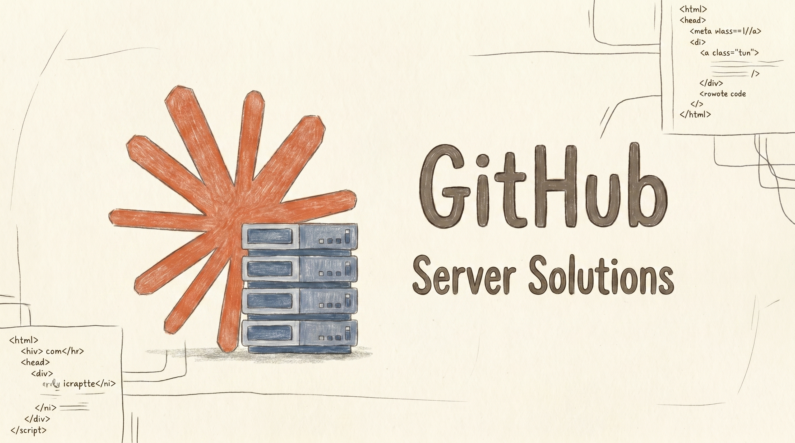

<!--
  Copyright (c) 2026 Rithika Liyanage (https://github.com/k-rithik04)
  Licensed under the MIT License - see LICENSE for details
-->

<p align="center">
  
</p>

# Claude-NIM Proxy

[](LICENSE)
[](https://code.visualstudio.com/)
[](https://www.npmjs.com/package/claude-nim)
[](https://github.com/claude-nim/claude-nim)

A VS Code extension that lets you use **NVIDIA NIM models** with **Claude Code** (and any Anthropic Messages API client).

It translates Anthropic Messages API requests into OpenAI-compatible requests for the NVIDIA NIM platform — no permanent config changes required.

## How It Works

```
Claude Code  ──→  Claude-NIM Proxy  ──→  NVIDIA NIM API
(Anthropic API)   (localhost:3456)       (OpenAI-compatible)
```

1. Install the VS Code extension and set your NVIDIA NIM API key
2. Start the proxy from the VS Code status bar or command palette
3. Use the "Launch Claude Code with Proxy" command to open a pre-configured terminal
4. When you stop the proxy, everything reverts — zero permanent changes

## Quick Start

```bash
# VS Code extension
npm install -g @anthropic-ai/claude-code   # or install from marketplace
# Then install this extension and set your API key via the command palette

# Standalone CLI (no VS Code required)
npx claude-nim --port 3456 --api-key nvapi-xxx
```

## Why Claude-NIM Proxy?

### Compared to CLI-only proxies (claude-code-proxy, CCProxy, LiteLLM)

| Feature | Claude-NIM Proxy | CLI Proxies (Python/Go) |
|---------|-----------------|------------------------|
| VS Code integration | Status bar, commands, SecretStorage | None — manual env vars |
| One-click model selection | Browse 100+ NIM models in VS Code | Config file editing |
| Encrypted API key storage | AES-256-GCM in VS Code SecretStorage | Plaintext env vars or config files |
| Launch Claude Code | One command opens pre-configured terminal | Manual `export ANTHROPIC_BASE_URL=...` |
| Zero-config onboarding | Interactive key prompt, auto-detection | Requires Python/pip/Go, manual setup |
| Reactive settings | Port/timeout/cache changes apply live | Requires restart |

### Compared to Claude Code Router (26k stars)

| Feature | Claude-NIM Proxy | Claude Code Router |
|---------|-----------------|-------------------|
| Setup | `npm install` + VS Code command | `npm install` + config.json + `ccr start` |
| VS Code integration | Full (status bar, commands, model browser) | None |
| Model-family adapters | 12 adapters fixing per-model quirks | Generic passthrough |
| Security | Prompt injection scrubbing, context pruning, body limits | None |
| Test coverage | 32 tests + 100-stream stress test | Minimal |
| Language | TypeScript (zero runtime deps) | Node.js + YAML config |
| Reasoning toggle | Control `<think>` visibility from VS Code | Not available |

### Compared to CCProxy (Orchestre)

| Feature | Claude-NIM Proxy | CCProxy |
|---------|-----------------|---------|
| Language | TypeScript (zero deps besides jsonrepair) | Go (binary) |
| VS Code integration | Full extension | CLI only |
| Model adapters | 12 model-family adapters | Generic |
| Security | Prompt injection defense, context pruning | None |
| CLI mode | Standalone `npx claude-nim` with encrypted keys | Requires config file |
| Test coverage | 32 tests + stress test | None public |

---

## What Makes This Different

### 1. Model-Family Adapters (Unique)

12 built-in adapters that fix per-model quirks so you don't have to:

| Adapter | What it fixes |
|---------|--------------|
| **DeepSeek R1/V3** | Disables `tool_choice: any`, caps temperature 0.6 |
| **Llama 3.x/4.x** | Caps temperature 0.7, enables structured JSON outputs |
| **Qwen 2.5/3** | Caps temperature 0.7, sets stop tokens |
| **Kimi K2.x** | Caps temperature 0.6 |
| **Nemotron Ultra/Super** | Caps temperature 0.6, enforces max_tokens |
| Mistral, Phi, Gemma, Command-R | Model-specific handling |

**Why it matters:** Generic proxies pass through parameters unchanged, causing hallucinations, tool call failures, or crashes on incompatible models.

### 2. Full Anthropic Content Type Translation

| Content Type | Our Handling | Competitors |
|---|---|---|
| `text` blocks | Direct mapping | Basic |
| `tool_use` blocks | Converted to OpenAI `tool_calls` | Partial |
| `tool_result` blocks | Converted with `tool_call_id` | Often broken |
| **Image (base64)** | Converted to `image_url` data URI | Not handled |
| Mixed text+tool results | Split into separate messages | Crashes |
| `tool_result` with `is_error` | `[ERROR]` prefix preserved | Lost |
| `system` prompt (string/array) | Converted to system message | Basic |
| `tool_choice` (auto/any/tool) | Full mapping to OpenAI equivalents | `auto` only |

### 3. Security (Unique Among Proxies)

No other proxy in the ecosystem includes:

- **Prompt injection scrubbing** — Neutralizes `ignore previous instructions` and `you are now` patterns before they reach the model
- **Context pruning** — Auto-trims large tool outputs (over 100K chars) to prevent context overflow
- **10 MB request body limit** — Prevents memory exhaustion
- **Unicode sanitization** — Strips U+FFFD replacement characters that cause encoding corruption
- **Localhost-only binding** — Server never exposed to network

### 4. VS Code Integration (Unique)

No CLI-only proxy offers:

- **Status bar** — Click to toggle proxy, shows running/stopped state with port
- **API key management** — Stored in VS Code SecretStorage (never plaintext)
- **Model browser** — Fetches 100+ NIM models, shows context windows, one-click selection
- **One-click launch** — Opens a pre-configured terminal ready for Claude Code
- **Reactive settings** — Port, timeout, cache TTL changes apply without restart
- **Debug logging** — Toggle and view proxy logs from VS Code

### 5. Standalone CLI

```bash
npx claude-nim                              # Interactive setup
npx claude-nim --port 8080 --model deepseek-r1  # Explicit config
```

Features:
- **AES-256-GCM encrypted key storage** — Machine-specific encryption key
- **Dynamic port selection** — Falls back to ephemeral port if 3456 is busy
- **Interactive onboarding** — Prompts for API key if not stored
- **Claude auto-detection** — Checks if `claude` CLI is installed, offers to install
- **Zombie-free teardown** — SIGINT/SIGTERM handlers kill all child processes

### 6. 7-Layer Error Handling

1. HTTP status mapping (AUTH_FAILED → 401, RATE_LIMITED → 429)
2. SSE error events in the stream
3. VS Code error notifications
4. Retry with exponential backoff (respects `Retry-After` headers)
5. Configurable stream idle timeout
6. 10 MB body size limit
7. JSON parse error messages with context

### 7. Production-Ready Infrastructure

- **Zero runtime dependencies** (except `jsonrepair`)
- **32 real tests** including 100-concurrent-stream stress test
- **TypeScript** with full type safety
- **CI/CD** with GitHub Actions (build, lint, test, auto-package VSIX)
- **Force-close connections** — Tracks and destroys all sockets on stop (no hanging)
- **CORS support** — Works with browser-based clients

## VS Code Commands

| Command | Description |
|---------|-------------|
| `Claude NIM Proxy: Manage NVIDIA NIM API Key` | Set, update, or clear your API key |
| `Claude NIM Proxy: Toggle Proxy Server` | Start or stop the proxy |
| `Claude NIM Proxy: Toggle Debug Logging` | Enable/disable debug output |
| `Claude NIM Proxy: Open Debug Log` | View proxy logs |
| `Claude NIM Proxy: Select Default Model` | Browse and select a default NIM model |
| `Claude NIM Proxy: Launch Claude Code with Proxy` | Open a terminal ready to use Claude Code |
| `Claude NIM Proxy: Toggle Show Reasoning` | Show/hide model thinking (`<think>`) output |

## Configuration

| Setting | Default | Description |
|---------|---------|-------------|
| `nvidia-nim.proxyPort` | `3456` | Port for the proxy server |
| `nvidia-nim.defaultModel` | `""` | Default model (empty = require in request) |
| `nvidia-nim.modelsCacheTTL` | `5` | Model cache TTL in minutes |
| `nvidia-nim.requestTimeout` | `120` | Stream idle timeout in seconds |

## Supported Models

Any model available on [build.nvidia.com](https://build.nvidia.com), including:

- **DeepSeek** R1, V3, V4
- **Llama** 3.x, 4.x
- **Mistral** Large, Medium
- **Qwen** 3, 2.5
- **Kimi** K2.x
- **Nemotron** Ultra, Super
- **Gemma** 3
- **Phi** 4
- **Command-R**+
- And 100+ more

## Dynamic Model Switching

Switch models on-the-fly without restarting the proxy or Claude Code.

### From Claude Code's `/model` Command

```
/model deepseek-r1            # Switch to DeepSeek R1
/model #3                     # Select model #3 from /models list
/model                        # Show available models
```

### API Endpoints

| Endpoint | Method | Description |
|----------|--------|-------------|
| `/api/model` | GET | Get current model |
| `/api/model` | POST | Set model (body: `{"model": "deepseek-r1"}`) |
| `/api/models` | GET | List all available NIM models |
| `/api/key` | POST | Update API key (body: `{"apiKey": "nvapi-..."}`) |
| `/api/metrics` | GET | SSE stream of real-time request metrics |
| `/api/metrics/history` | GET | Historical metrics (last 1000 requests) |
| `/api/stats` | GET | Aggregate stats (total requests, tokens, latency) |

### Persistence

Model state and metrics persist across proxy restarts via `~/.claude-nim/`:
- `state.json` — Current model, cache TTL
- `metrics.jsonl` — Request history (auto-rotated at 2 MB)

## Dashboard

Open the dashboard in your browser:

```
http://127.0.0.1:3456/dashboard
```

Features:
- **Real-time packet animation** — See requests flow between Claude Code ↔ Proxy ↔ NIM
- **Live stats** — Request count, total tokens, average latency, peak tokens/sec, uptime
- **Model selector** — Browse and switch between all available NIM models
- **API key management** — Update your key without restarting
- **Request history** — Table of all requests with model, token counts, latency, status
- **Live logs** — Color-coded real-time proxy log stream

## `ANTHROPIC_CUSTOM_MODEL_OPTION`

The proxy injects the `ANTHROPIC_CUSTOM_MODEL_OPTION` environment variable when launching Claude Code, which makes all NIM models appear in Claude Code's native model picker.

Without this env var, Claude Code filters models to only show ones matching `/^(claude|anthropic)/i`. The custom option bypasses this filter.

```json
// Example ANTHROPIC_CUSTOM_MODEL_OPTION value
[
  {"value":"deepseek-r1","label":"DeepSeek R1","description":"via NVIDIA NIM"},
  {"value":"meta/llama-3.3-70b-instruct","label":"Llama 3.3 70B","description":"via NVIDIA NIM"}
]
```

This is set automatically when using "Launch Claude Code with Proxy" or the `npx claude-nim` CLI.

## Limitations

- **Claude Code's native model picker** shows NIM models only when launched via this proxy's terminal/CLI (requires `ANTHROPIC_CUSTOM_MODEL_OPTION`)
- **Tool use** works for models that support it (DeepSeek R1, Llama 3.x/4x, etc.) — unsupported models may produce malformed tool calls
- **Streaming** requires the model to support SSE; some older NIM models may not stream correctly
- **Max tokens** is capped at 16K for most models; some support up to 32K
- **Images** are sent as base64 data URIs — the model must support vision
- **Rate limiting** is handled by retry with backoff, but aggressive usage may hit NIM quotas
- **Reasoning/thinking** toggle only affects display; the model still generates reasoning tokens

## Build

```bash
npm install
npm run compile       # Compile TypeScript → out/
npm run test          # Run 32 tests
npm run lint          # ESLint check
npm run package:vsix  # Package as .vsix
```

## Contributing

Contributions are welcome. Please open an issue or submit a pull request at [github.com/claude-nim/claude-nim](https://github.com/claude-nim/claude-nim).

## License

MIT — see [LICENSE](LICENSE) for details.

## Author

**Rithika Liyanage** — [github.com/k-rithik04](https://github.com/k-rithik04)
